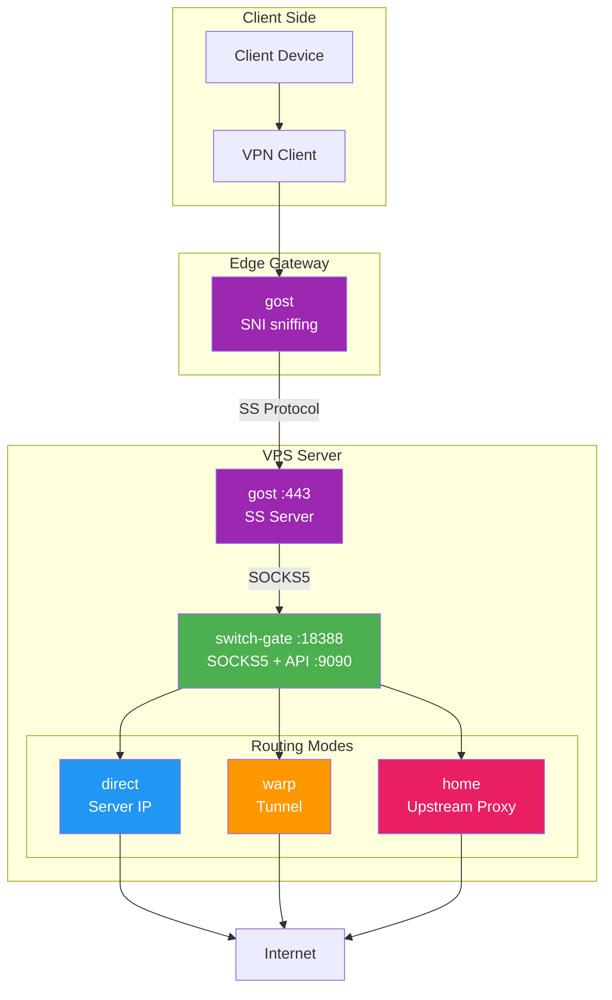
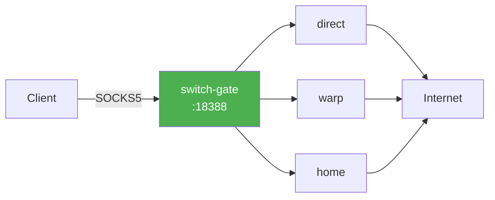

# Architecture

## Overview

switch-gate is an outbound traffic router that allows dynamic switching between different routing modes via HTTP API.

## Traffic Flow



## Standalone Mode

switch-gate can also work without gost, directly accepting SOCKS5 connections:



## Components

### SOCKS5 Proxy Server

- Listens for incoming SOCKS5 connections
- Performs SOCKS5 handshake (no authentication)
- Extracts target address from SOCKS5 CONNECT request
- Routes connection through the current mode's dialer

### Transparent Proxy Server (Linux only)

- Handles connections redirected by iptables REDIRECT
- Extracts original destination using `SO_ORIGINAL_DST` socket option
- Routes connection through the current mode's dialer

### Router

- Manages available dialers (direct, warp, home)
- Thread-safe mode switching
- Automatic fallback to direct if tunnel fails
- Traffic limit enforcement with auto-switching

### Dialers

| Dialer | Description |
|--------|-------------|
| `DirectDialer` | Uses server's default routing (can bind to specific IP) |
| `WarpDialer` | Routes through tunnel interface via policy routing |
| `Socks5Dialer` | Routes through upstream SOCKS5 proxy |

### HTTP API Server

- RESTful API for mode switching and status
- Prometheus-compatible metrics endpoint
- Health check endpoint

## Routing Modes

### Direct Mode

Traffic goes through the server's default network interface.

```
Client → switch-gate → Server's default route → Internet
```

**Use case:** Testing, accessing services that need server's IP.

### Tunnel Mode (warp)

Traffic goes through a tunnel interface (e.g., WireGuard, Cloudflare WARP).

```
Client → switch-gate → Tunnel interface → Tunnel provider → Internet
```

**Configuration:** Tunnel must be configured separately with policy routing.

**Use case:** Privacy, bypassing geo-restrictions.

### Upstream Proxy Mode (home)

Traffic goes through an external SOCKS5 proxy.

```
Client → switch-gate → Upstream SOCKS5 → Proxy provider → Internet
```

**Use case:** Residential IP, services with strict IP verification.

## Traffic Limits

Home mode supports traffic limits:

```yaml
limits:
  home:
    max_mb: 100           # Limit in MB
    auto_switch_to: "warp" # Mode to switch to when limit is reached
```

When the limit is reached:
1. New connections to home mode are rejected
2. Router automatically switches to the fallback mode
3. Existing connections continue until closed

## Thread Safety

- Mode switching is protected by RWMutex
- Metrics use atomic counters
- Connection tracking is mutex-protected

## Graceful Shutdown

On SIGINT/SIGTERM:
1. Stop accepting new connections
2. Close all active connections
3. Shutdown API server with timeout
4. Exit cleanly

## Integration with gost

[gost](https://github.com/go-gost/gost) acts as a protocol translator:

| Component | Role |
|-----------|------|
| gost (edge) | SNI sniffing, extracts domain from TLS ClientHello |
| gost (VPS) | Shadowsocks server, forwards to switch-gate SOCKS5 |
| switch-gate | Routes traffic based on current mode |

This preserves domain names through the entire chain, which is required for some upstream proxies.
