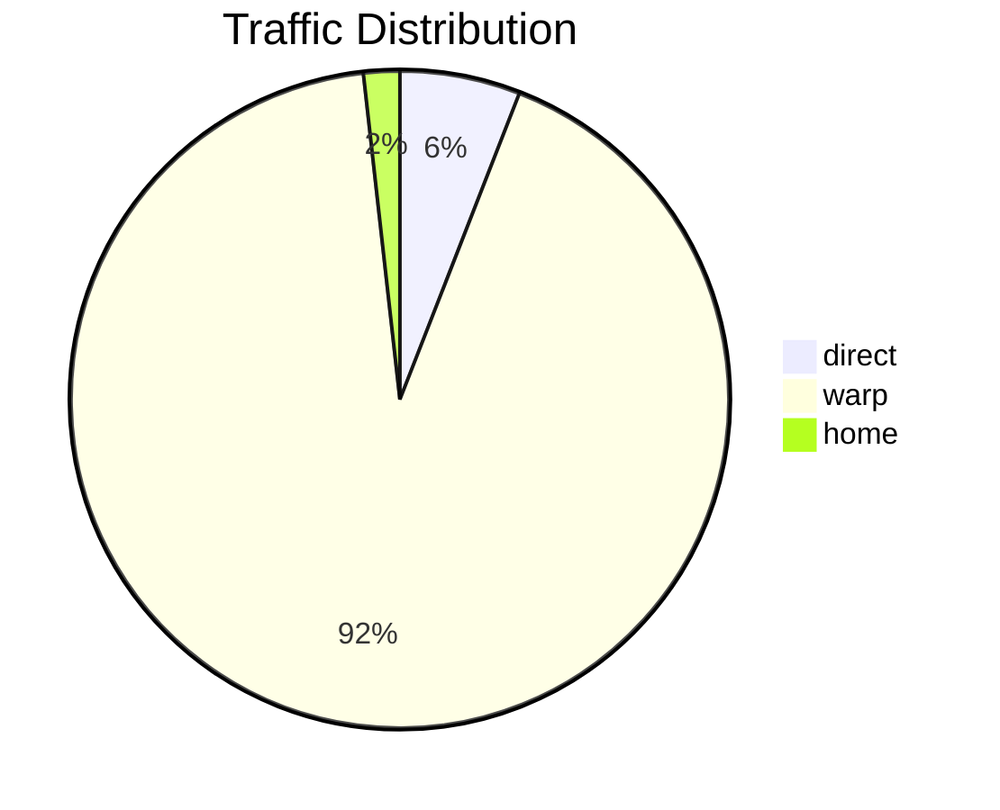

# Monitoring

switch-gate provides comprehensive monitoring capabilities through metrics, events, and health checks.

## Metrics

### Prometheus Endpoint

Metrics are exposed at `GET /metrics` in Prometheus format.

```bash
curl http://localhost:9090/metrics
```

### Available Metrics

| Metric | Type | Labels | Description |
|--------|------|--------|-------------|
| `switch_gate_bytes_total` | counter | `mode` | Total bytes transferred per mode |
| `switch_gate_connections_active` | gauge | — | Current active connections |
| `switch_gate_connections_total` | counter | — | Total connections since start |
| `switch_gate_uptime_seconds` | gauge | — | Uptime in seconds |

### Example Output

```
# HELP switch_gate_bytes_total Total bytes transferred
# TYPE switch_gate_bytes_total counter
switch_gate_bytes_total{mode="direct"} 157810688
switch_gate_bytes_total{mode="warp"} 2453299200
switch_gate_bytes_total{mode="home"} 47500288

# HELP switch_gate_connections_active Active connections
# TYPE switch_gate_connections_active gauge
switch_gate_connections_active 12

# HELP switch_gate_connections_total Total connections
# TYPE switch_gate_connections_total counter
switch_gate_connections_total 1847

# HELP switch_gate_uptime_seconds Uptime in seconds
# TYPE switch_gate_uptime_seconds gauge
switch_gate_uptime_seconds 9296
```

## Traffic Statistics

### Status Endpoint

`GET /status` returns current status with traffic statistics:

```json
{
  "mode": "warp",
  "uptime": "2h34m56s",
  "connections": 12,
  "traffic": {
    "direct_mb": 150.5,
    "warp_mb": 2340.2,
    "home_mb": 45.3,
    "total_mb": 2536.0
  },
  "home": {
    "limit_mb": 100,
    "used_mb": 45.3,
    "remaining_mb": 54.7,
    "cost_usd": 0.16
  },
  "available_modes": ["direct", "warp", "home"]
}
```

### Traffic Per Mode

Traffic is tracked separately for each routing mode:



## Health Checks

### Health Endpoint

`GET /health` returns service health status:

```json
{
  "status": "healthy"
}
```

### Integration Examples

**Docker Compose:**

```yaml
healthcheck:
  test: ["CMD", "curl", "-f", "http://localhost:9090/health"]
  interval: 30s
  timeout: 10s
  retries: 3
```

**Kubernetes:**

```yaml
livenessProbe:
  httpGet:
    path: /health
    port: 9090
  initialDelaySeconds: 5
  periodSeconds: 10

readinessProbe:
  httpGet:
    path: /health
    port: 9090
  initialDelaySeconds: 5
  periodSeconds: 5
```

## Events

### Mode Change Events

When mode changes via API, it's logged:

```
INFO: Mode switched to warp
```

### Limit Events

When home mode traffic limit is reached:

```
WARN: Home proxy limit reached, switching to warp
```

### Connection Events

Connection errors are logged at DEBUG level:

```
DEBUG: SOCKS5 handshake failed: connection reset
DEBUG: Failed to dial example.com:443: timeout
```

### Fallback Events

When tunnel mode fails and falls back to direct:

```
WARN: Tunnel dial failed, falling back to direct: connection refused
```

## Prometheus Integration

### Scrape Configuration

```yaml
scrape_configs:
  - job_name: 'switch-gate'
    static_configs:
      - targets: ['switch-gate-host:9090']
    metrics_path: '/metrics'
    scrape_interval: 15s
```

### Alerting Rules

Example Prometheus alerting rules:

```yaml
groups:
  - name: switch-gate
    rules:
      - alert: SwitchGateDown
        expr: up{job="switch-gate"} == 0
        for: 1m
        labels:
          severity: critical
        annotations:
          summary: "switch-gate is down"

      - alert: SwitchGateHighConnections
        expr: switch_gate_connections_active > 100
        for: 5m
        labels:
          severity: warning
        annotations:
          summary: "High number of active connections"

      - alert: SwitchGateHomeLimitNear
        expr: |
          (switch_gate_bytes_total{mode="home"} / 1024 / 1024) 
          / on() group_left switch_gate_home_limit_mb > 0.9
        for: 1m
        labels:
          severity: warning
        annotations:
          summary: "Home mode traffic limit nearly exhausted"
```

## Grafana Dashboard

### Suggested Panels

| Panel | Query | Visualization |
|-------|-------|---------------|
| Traffic by Mode | `rate(switch_gate_bytes_total[5m])` | Time series |
| Active Connections | `switch_gate_connections_active` | Gauge |
| Total Traffic | `sum(switch_gate_bytes_total)` | Stat |
| Uptime | `switch_gate_uptime_seconds / 3600` | Stat (hours) |
| Connections/sec | `rate(switch_gate_connections_total[1m])` | Time series |

### Traffic Rate Query

```promql
# Bytes per second by mode
rate(switch_gate_bytes_total[5m])

# MB per hour by mode  
rate(switch_gate_bytes_total[1h]) * 3600 / 1024 / 1024
```

## Logging

### Log Levels

| Level | Description |
|-------|-------------|
| `DEBUG` | Connection details, handshake info |
| `INFO` | Mode switches, startup, shutdown |
| `WARN` | Fallbacks, limit reached |
| `ERROR` | Accept failures, critical errors |

### Log Format

Configured via `logging.format` in config:

**JSON format:**
```json
{"level":"info","msg":"Mode switched to warp","time":"2024-01-26T12:00:00Z"}
```

**Text format:**
```
2024/01/26 12:00:00 INFO: Mode switched to warp
```

## Cost Tracking

Home mode includes estimated cost tracking based on traffic:

```json
{
  "home": {
    "used_mb": 45.3,
    "cost_usd": 0.16
  }
}
```

Cost is calculated as: `used_mb / 1024 * $3.50/GB`

Adjust the rate in your monitoring system if your provider has different pricing.
